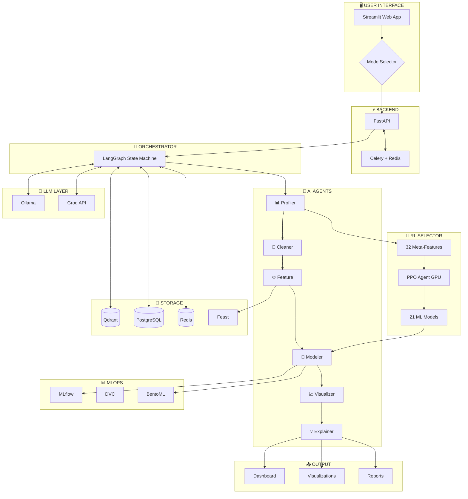
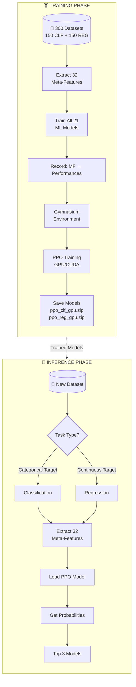
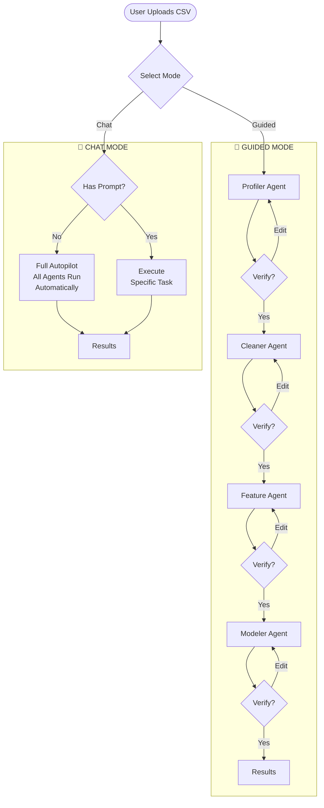

# 🚀 DataPilot AI Pro - Complete System Flow Diagram

## 📋 Table of Contents
1. [Project Overview](#1-project-overview)
2. [High-Level Architecture](#2-high-level-architecture)
3. [Component Breakdown](#3-component-breakdown)
4. [User Interaction Modes](#4-user-interaction-modes)
5. [Data Flow Diagrams](#5-data-flow-diagrams)
6. [RL Model Selector Flow](#6-rl-model-selector-flow)
7. [Agent Execution Flow](#7-agent-execution-flow)
8. [Eraser.io Diagram Code](#8-eraserio-diagram-code)
9. [Mermaid Diagrams](#9-mermaid-diagrams)

---

## 1. Project Overview

```
╔══════════════════════════════════════════════════════════════════════════════════╗
║                           🚀 DataPilot AI Pro                                    ║
║              Enterprise Autonomous Data Science Platform                          ║
╠══════════════════════════════════════════════════════════════════════════════════╣
║                                                                                  ║
║   📊 WHAT IT DOES:                                                               ║
║   • Takes any CSV dataset as input                                               ║
║   • Automatically performs end-to-end data science pipeline                      ║
║   • Uses AI agents for each stage (cleaning, feature eng, modeling)              ║
║   • RL-based intelligent model selection (GPU-accelerated)                       ║
║   • Generates insights, predictions, and visualizations                          ║
║                                                                                  ║
║   🎯 KEY DIFFERENTIATORS:                                                        ║
║   • Multi-Agent Architecture (6 specialized AI agents)                           ║
║   • Two interaction modes (Guided + Chat)                                        ║
║   • GPU-accelerated RL Model Selector                                            ║
║   • Ensemble methods (mandatory)                                                 ║
║   • Explainability dashboard (SHAP/LIME)                                         ║
║   • Persistent memory with vector database                                       ║
║                                                                                  ║
╚══════════════════════════════════════════════════════════════════════════════════╝
```

---

## 2. High-Level Architecture

```
┌─────────────────────────────────────────────────────────────────────────────────────┐
│                        DataPilot AI Pro - System Architecture                        │
└─────────────────────────────────────────────────────────────────────────────────────┘

                                    ┌─────────────┐
                                    │    USER     │
                                    │  (Browser)  │
                                    └──────┬──────┘
                                           │
                                           ▼
┌─────────────────────────────────────────────────────────────────────────────────────┐
│                              🖥️ USER INTERFACE LAYER                                │
├─────────────────────────────────────────────────────────────────────────────────────┤
│                                                                                     │
│    ┌──────────────────┐    ┌──────────────────┐    ┌──────────────────┐            │
│    │   📱 Streamlit    │    │    🔌 REST API   │    │    💻 CLI        │            │
│    │    Web App       │    │    (Optional)    │    │   (Optional)     │            │
│    └────────┬─────────┘    └────────┬─────────┘    └────────┬─────────┘            │
│             │                       │                       │                       │
│             └───────────────────────┼───────────────────────┘                       │
│                                     │                                               │
│                        ┌────────────┴────────────┐                                  │
│                        │    🔀 MODE SELECTOR     │                                  │
│                        │  • Guided Mode          │                                  │
│                        │  • Chat Mode            │                                  │
│                        └────────────┬────────────┘                                  │
└─────────────────────────────────────┼───────────────────────────────────────────────┘
                                      │
                                      ▼
┌─────────────────────────────────────────────────────────────────────────────────────┐
│                              ⚡ API / BACKEND LAYER                                  │
├─────────────────────────────────────────────────────────────────────────────────────┤
│                                                                                     │
│    ┌──────────────────────────┐         ┌──────────────────────────┐               │
│    │      🚀 FastAPI          │         │    📥 Celery + Redis     │               │
│    │   • File Upload          │◄───────►│    • Async Tasks         │               │
│    │   • Session Management   │         │    • Job Queue           │               │
│    │   • Request Routing      │         │    • Background Jobs     │               │
│    └────────────┬─────────────┘         └──────────────────────────┘               │
│                 │                                                                   │
└─────────────────┼───────────────────────────────────────────────────────────────────┘
                  │
                  ▼
┌─────────────────────────────────────────────────────────────────────────────────────┐
│                           🧠 ORCHESTRATOR LAYER (Central Brain)                     │
├─────────────────────────────────────────────────────────────────────────────────────┤
│                                                                                     │
│                        ┌─────────────────────────────┐                              │
│                        │   🎯 LangGraph Orchestrator │                              │
│                        │   ─────────────────────────  │                              │
│                        │   • State Machine           │                              │
│                        │   • Agent Coordination      │                              │
│                        │   • Workflow Management     │                              │
│                        │   • Error Recovery          │                              │
│                        │   • Decision Making         │                              │
│                        └──────────────┬──────────────┘                              │
│                                       │                                             │
│         ┌─────────────────────────────┼─────────────────────────────┐               │
│         │                             │                             │               │
│         ▼                             ▼                             ▼               │
│  ┌─────────────┐            ┌─────────────────┐            ┌─────────────┐          │
│  │ 🔮 LLM API  │            │ 🎯 RL Selector  │            │ 💾 Storage  │          │
│  │   Layer    │            │     (GPU)       │            │   Layer    │          │
│  └─────────────┘            └─────────────────┘            └─────────────┘          │
│                                                                                     │
└─────────────────────────────────────────────────────────────────────────────────────┘
                                      │
                                      ▼
┌─────────────────────────────────────────────────────────────────────────────────────┐
│                           🤖 MULTI-AGENT LAYER (6 Agents)                           │
├─────────────────────────────────────────────────────────────────────────────────────┤
│                                                                                     │
│   ┌─────────┐   ┌─────────┐   ┌─────────┐   ┌─────────┐   ┌─────────┐   ┌─────────┐│
│   │   📊    │   │   🧹    │   │   ⚙️    │   │   🎯    │   │   📈    │   │   💡    ││
│   │PROFILER │──▶│ CLEANER │──▶│ FEATURE │──▶│ MODELER │──▶│  VIZ    │──▶│EXPLAINER││
│   │ AGENT   │   │ AGENT   │   │ AGENT   │   │ AGENT   │   │ AGENT   │   │ AGENT   ││
│   └─────────┘   └─────────┘   └─────────┘   └─────────┘   └─────────┘   └─────────┘│
│       │             │             │             │             │             │       │
│       │             │             │             │             │             │       │
│   • Data Types   • Handle     • Encoding    • RL Model   • Auto        • SHAP     │
│   • Statistics     Nulls      • Scaling       Selection    Insights    • LIME     │
│   • Target       • Outliers   • Creation    • Training   • Charts     • Reports   │
│     Detection    • Duplicates • Selection   • Ensemble   • Dashboard  • Export    │
│                                                                                     │
└─────────────────────────────────────────────────────────────────────────────────────┘
                                      │
          ┌───────────────────────────┼───────────────────────────┐
          │                           │                           │
          ▼                           ▼                           ▼
┌──────────────────┐    ┌──────────────────────┐    ┌──────────────────────┐
│  🔮 LLM LAYER    │    │  🎯 RL MODEL SELECTOR │    │   💾 DATA LAYER      │
├──────────────────┤    ├──────────────────────┤    ├──────────────────────┤
│                  │    │                      │    │                      │
│ ┌──────────────┐ │    │ ┌──────────────────┐ │    │ ┌──────────────────┐ │
│ │   Ollama     │ │    │ │  Meta-Features   │ │    │ │    Qdrant        │ │
│ │   (Local)    │ │    │ │  (32 Features)   │ │    │ │  (Vector DB)     │ │
│ └──────────────┘ │    │ └────────┬─────────┘ │    │ └──────────────────┘ │
│                  │    │          │           │    │                      │
│ ┌──────────────┐ │    │          ▼           │    │ ┌──────────────────┐ │
│ │   Groq API   │ │    │ ┌──────────────────┐ │    │ │   PostgreSQL     │ │
│ │   (Cloud)    │ │    │ │   PPO Agent      │ │    │ │  (Relational)    │ │
│ └──────────────┘ │    │ │   (GPU/CUDA)     │ │    │ └──────────────────┘ │
│                  │    │ └────────┬─────────┘ │    │                      │
│ ┌──────────────┐ │    │          │           │    │ ┌──────────────────┐ │
│ │ Claude/GPT   │ │    │          ▼           │    │ │     Redis        │ │
│ │  (Optional)  │ │    │ ┌──────────────────┐ │    │ │    (Cache)       │ │
│ └──────────────┘ │    │ │   Model Pool     │ │    │ └──────────────────┘ │
│                  │    │ │ • XGBoost (GPU)  │ │    │                      │
│                  │    │ │ • LightGBM (GPU) │ │    │ ┌──────────────────┐ │
│                  │    │ │ • CatBoost (GPU) │ │    │ │     Feast        │ │
│                  │    │ │ • RandomForest   │ │    │ │ (Feature Store)  │ │
│                  │    │ │ • + 17 more      │ │    │ └──────────────────┘ │
│                  │    │ └──────────────────┘ │    │                      │
└──────────────────┘    └──────────────────────┘    └──────────────────────┘
                                      │
                                      ▼
┌─────────────────────────────────────────────────────────────────────────────────────┐
│                              📊 MLOps LAYER                                         │
├─────────────────────────────────────────────────────────────────────────────────────┤
│                                                                                     │
│    ┌──────────────────┐    ┌──────────────────┐    ┌──────────────────┐            │
│    │    📊 MLflow     │    │     📁 DVC       │    │   🚀 BentoML     │            │
│    │   Experiment     │    │     Data         │    │     Model        │            │
│    │    Tracking      │    │   Versioning     │    │    Serving       │            │
│    └──────────────────┘    └──────────────────┘    └──────────────────┘            │
│                                                                                     │
└─────────────────────────────────────────────────────────────────────────────────────┘
                                      │
                                      ▼
┌─────────────────────────────────────────────────────────────────────────────────────┐
│                              📤 OUTPUT LAYER                                        │
├─────────────────────────────────────────────────────────────────────────────────────┤
│                                                                                     │
│    ┌──────────────────┐    ┌──────────────────┐    ┌──────────────────┐            │
│    │  📊 Dashboard    │    │  📈 Visualizations│    │   📄 Reports     │            │
│    │   • Results      │    │   • Plotly Charts │    │   • PDF Export   │            │
│    │   • Metrics      │    │   • Insights      │    │   • Jupyter NB   │            │
│    │   • Predictions  │    │   • SHAP Plots    │    │   • Python Code  │            │
│    └──────────────────┘    └──────────────────┘    └──────────────────┘            │
│                                                                                     │
└─────────────────────────────────────────────────────────────────────────────────────┘
```

---

## 3. Component Breakdown

### 3.1 Technology Stack

```
┌─────────────────────────────────────────────────────────────────────────────────────┐
│                              🛠️ TECHNOLOGY STACK                                    │
└─────────────────────────────────────────────────────────────────────────────────────┘

┌─────────────────────┬───────────────────────────────────────────────────────────────┐
│      LAYER          │                        TECHNOLOGIES                           │
├─────────────────────┼───────────────────────────────────────────────────────────────┤
│                     │                                                               │
│  🖥️ Frontend        │  Streamlit, Plotly, HTML/CSS                                  │
│                     │                                                               │
├─────────────────────┼───────────────────────────────────────────────────────────────┤
│                     │                                                               │
│  ⚡ Backend         │  FastAPI, Celery, Redis, Pydantic                             │
│                     │                                                               │
├─────────────────────┼───────────────────────────────────────────────────────────────┤
│                     │                                                               │
│  🧠 Orchestration   │  LangGraph, LangChain                                         │
│                     │                                                               │
├─────────────────────┼───────────────────────────────────────────────────────────────┤
│                     │                                                               │
│  🤖 AI Agents       │  Custom Python Agents with LLM Integration                    │
│                     │                                                               │
├─────────────────────┼───────────────────────────────────────────────────────────────┤
│                     │                                                               │
│  🔮 LLM             │  Ollama (local), Groq API (cloud), Claude/GPT (optional)      │
│                     │                                                               │
├─────────────────────┼───────────────────────────────────────────────────────────────┤
│                     │                                                               │
│  🎯 RL Selector     │  Stable-Baselines3 (PPO), Gymnasium, PyTorch (CUDA)           │
│                     │                                                               │
├─────────────────────┼───────────────────────────────────────────────────────────────┤
│                     │                                                               │
│  🤖 ML Models       │  XGBoost, LightGBM, CatBoost, Scikit-learn (all GPU)          │
│                     │                                                               │
├─────────────────────┼───────────────────────────────────────────────────────────────┤
│                     │                                                               │
│  💾 Databases       │  PostgreSQL, Qdrant (Vector), Redis (Cache), Feast            │
│                     │                                                               │
├─────────────────────┼───────────────────────────────────────────────────────────────┤
│                     │                                                               │
│  📊 MLOps           │  MLflow, DVC, BentoML                                         │
│                     │                                                               │
├─────────────────────┼───────────────────────────────────────────────────────────────┤
│                     │                                                               │
│  💡 Explainability  │  SHAP, LIME, Plotly                                           │
│                     │                                                               │
├─────────────────────┼───────────────────────────────────────────────────────────────┤
│                     │                                                               │
│  🐳 Infrastructure  │  Docker, Docker Compose, NVIDIA Container Toolkit             │
│                     │                                                               │
└─────────────────────┴───────────────────────────────────────────────────────────────┘
```

### 3.2 AI Agents Detail

```
┌─────────────────────────────────────────────────────────────────────────────────────┐
│                              🤖 AI AGENTS DETAIL                                    │
└─────────────────────────────────────────────────────────────────────────────────────┘

┌─────────────────────────────────────────────────────────────────────────────────────┐
│  📊 PROFILER AGENT                                                                  │
├─────────────────────────────────────────────────────────────────────────────────────┤
│  INPUT:  Raw CSV file                                                               │
│  OUTPUT: Data profile report                                                        │
│                                                                                     │
│  TASKS:                                                                             │
│    • Detect column data types (numeric, categorical, datetime, text)                │
│    • Calculate basic statistics (mean, median, std, min, max)                       │
│    • Identify target variable (classification vs regression)                        │
│    • Detect missing values pattern                                                  │
│    • Generate initial data quality score                                            │
│    • Extract 32 meta-features for RL Model Selector                                 │
└─────────────────────────────────────────────────────────────────────────────────────┘
                                      │
                                      ▼
┌─────────────────────────────────────────────────────────────────────────────────────┐
│  🧹 CLEANER AGENT                                                                   │
├─────────────────────────────────────────────────────────────────────────────────────┤
│  INPUT:  Profiled data + profile report                                             │
│  OUTPUT: Cleaned dataset                                                            │
│                                                                                     │
│  TASKS:                                                                             │
│    • Handle missing values (imputation strategies based on data type)               │
│    • Detect and handle outliers (IQR, Z-score methods)                              │
│    • Remove duplicates                                                              │
│    • Fix data type inconsistencies                                                  │
│    • Handle infinite values                                                         │
│    • Log all transformations for reproducibility                                    │
└─────────────────────────────────────────────────────────────────────────────────────┘
                                      │
                                      ▼
┌─────────────────────────────────────────────────────────────────────────────────────┐
│  ⚙️ FEATURE AGENT                                                                    │
├─────────────────────────────────────────────────────────────────────────────────────┤
│  INPUT:  Cleaned dataset                                                            │
│  OUTPUT: Feature-engineered dataset                                                 │
│                                                                                     │
│  TASKS:                                                                             │
│    • Encode categorical variables (OneHot, Label, Target encoding)                  │
│    • Scale numerical features (StandardScaler, MinMaxScaler, RobustScaler)          │
│    • Create interaction features                                                    │
│    • Generate polynomial features (if beneficial)                                   │
│    • Feature selection (correlation, importance-based)                              │
│    • Store features in Feast feature store                                          │
└─────────────────────────────────────────────────────────────────────────────────────┘
                                      │
                                      ▼
┌─────────────────────────────────────────────────────────────────────────────────────┐
│  🎯 MODELER AGENT                                                                   │
├─────────────────────────────────────────────────────────────────────────────────────┤
│  INPUT:  Feature-engineered dataset + meta-features                                 │
│  OUTPUT: Trained models + predictions                                               │
│                                                                                     │
│  TASKS:                                                                             │
│    • Call RL Model Selector to get top 3 recommended models                         │
│    • Train selected models (GPU-accelerated)                                        │
│    • Hyperparameter tuning (Optuna)                                                 │
│    • Cross-validation evaluation                                                    │
│    • Create ensemble model (MANDATORY)                                              │
│    • Log experiments to MLflow                                                      │
│    • Save models via BentoML                                                        │
│                                                                                     │
│  MODELS POOL (21 Total):                                                            │
│    Classification (10): XGBoost, LightGBM, CatBoost, RandomForest, ExtraTrees,     │
│                         GradientBoosting, LogisticRegression, SVC, KNN, NaiveBayes │
│    Regression (11): XGBoost, LightGBM, CatBoost, RandomForest, ExtraTrees,         │
│                     GradientBoosting, Ridge, Lasso, ElasticNet, SVR, KNN           │
└─────────────────────────────────────────────────────────────────────────────────────┘
                                      │
                                      ▼
┌─────────────────────────────────────────────────────────────────────────────────────┐
│  📈 VISUALIZATION AGENT                                                             │
├─────────────────────────────────────────────────────────────────────────────────────┤
│  INPUT:  Data + Model results                                                       │
│  OUTPUT: Interactive visualizations                                                 │
│                                                                                     │
│  TASKS:                                                                             │
│    • Understand data and recommend best visualizations                              │
│    • Generate EDA charts (distributions, correlations, scatter plots)               │
│    • Create model performance charts (ROC, confusion matrix, residuals)             │
│    • Build interactive Plotly dashboards                                            │
│    • Auto-generate insights from visualizations                                     │
│    • Export charts to PNG/HTML                                                      │
└─────────────────────────────────────────────────────────────────────────────────────┘
                                      │
                                      ▼
┌─────────────────────────────────────────────────────────────────────────────────────┐
│  💡 EXPLAINER AGENT                                                                 │
├─────────────────────────────────────────────────────────────────────────────────────┤
│  INPUT:  Trained models + predictions                                               │
│  OUTPUT: Explanations + final report                                                │
│                                                                                     │
│  TASKS:                                                                             │
│    • Generate SHAP explanations (global + local)                                    │
│    • Generate LIME explanations                                                     │
│    • Feature importance analysis                                                    │
│    • Model comparison report                                                        │
│    • Create final PDF report                                                        │
│    • Export Jupyter notebook with all code                                          │
│    • Generate standalone Python code                                                │
└─────────────────────────────────────────────────────────────────────────────────────┘
```

---

## 4. User Interaction Modes

```
┌─────────────────────────────────────────────────────────────────────────────────────┐
│                          🎮 USER INTERACTION MODES                                  │
└─────────────────────────────────────────────────────────────────────────────────────┘


═══════════════════════════════════════════════════════════════════════════════════════
                              MODE 1: 🎯 GUIDED MODE
═══════════════════════════════════════════════════════════════════════════════════════

User has FULL CONTROL - verification required at EACH step

┌─────────┐     ┌──────────────┐     ┌─────────────┐     ┌──────────────┐
│  User   │────▶│ Upload CSV   │────▶│  Profiler   │────▶│   VERIFY?    │
│         │     │              │     │   Agent     │     │  [Y/N/Edit]  │
└─────────┘     └──────────────┘     └─────────────┘     └──────┬───────┘
                                                                │
                     ┌──────────────────────────────────────────┘
                     │
                     ▼
              ┌─────────────┐     ┌──────────────┐
              │   Cleaner   │────▶│   VERIFY?    │
              │   Agent     │     │  [Y/N/Edit]  │
              └─────────────┘     └──────┬───────┘
                                         │
                     ┌───────────────────┘
                     │
                     ▼
              ┌─────────────┐     ┌──────────────┐
              │   Feature   │────▶│   VERIFY?    │
              │   Agent     │     │  [Y/N/Edit]  │
              └─────────────┘     └──────┬───────┘
                                         │
                     ┌───────────────────┘
                     │
                     ▼
              ┌─────────────┐     ┌──────────────┐
              │   Modeler   │────▶│   VERIFY?    │
              │   Agent     │     │  [Y/N/Edit]  │
              └─────────────┘     └──────┬───────┘
                                         │
                     ┌───────────────────┘
                     │
                     ▼
              ┌─────────────────────────────────────┐
              │         📊 FINAL RESULTS            │
              │   • Dashboard                       │
              │   • Visualizations                  │
              │   • Explanations                    │
              │   • Export Options                  │
              └─────────────────────────────────────┘


═══════════════════════════════════════════════════════════════════════════════════════
                              MODE 2: 💬 CHAT MODE
═══════════════════════════════════════════════════════════════════════════════════════

Intelligent behavior based on user input:


SCENARIO A: Dataset Only → FULL AUTOPILOT
─────────────────────────────────────────

┌─────────┐     ┌──────────────┐     ┌─────────────────────────────────────────────────┐
│  User   │────▶│ Upload CSV   │────▶│              AUTOPILOT MODE                     │
│         │     │   (no prompt)│     │                                                 │
└─────────┘     └──────────────┘     │  Profiler → Cleaner → Feature → Modeler →      │
                                     │  Visualizer → Explainer                         │
                                     │                                                 │
                                     │  (All automated, no verification needed)        │
                                     └─────────────────────┬───────────────────────────┘
                                                           │
                                                           ▼
                                     ┌─────────────────────────────────────────────────┐
                                     │              📊 COMPLETE RESULTS                │
                                     │   • Full pipeline completed                     │
                                     │   • All visualizations generated                │
                                     │   • Explanations included                       │
                                     │   • Reports ready for download                  │
                                     └─────────────────────────────────────────────────┘


SCENARIO B: Dataset + Prompt → SPECIFIC TASK
────────────────────────────────────────────

┌─────────┐     ┌──────────────┐     ┌─────────────────────────────────────────────────┐
│  User   │────▶│ Upload CSV + │────▶│              TASK EXECUTOR                      │
│         │     │ "Show me     │     │                                                 │
└─────────┘     │  correlation │     │  Parse prompt → Identify task → Execute →      │
                │  heatmap"    │     │  Return specific result                         │
                └──────────────┘     │                                                 │
                                     │  (Only does what user asked)                    │
                                     └─────────────────────┬───────────────────────────┘
                                                           │
                                                           ▼
                                     ┌─────────────────────────────────────────────────┐
                                     │         📈 CORRELATION HEATMAP                  │
                                     │   (Only the requested visualization)            │
                                     └─────────────────────────────────────────────────┘


SCENARIO C: Just Prompt → CONVERSATION
──────────────────────────────────────

┌─────────┐     ┌──────────────┐     ┌─────────────────────────────────────────────────┐
│  User   │────▶│ "What models │────▶│              LLM CONVERSATION                   │
│         │     │  are best    │     │                                                 │
└─────────┘     │  for time    │     │  Direct answer using LLM knowledge              │
                │  series?"    │     │                                                 │
                └──────────────┘     └─────────────────────────────────────────────────┘
```

---

## 5. Data Flow Diagrams

### 5.1 Complete Pipeline Flow

```
┌─────────────────────────────────────────────────────────────────────────────────────┐
│                         📊 COMPLETE DATA FLOW PIPELINE                              │
└─────────────────────────────────────────────────────────────────────────────────────┘


    ┌───────────┐
    │   USER    │
    │  Browser  │
    └─────┬─────┘
          │
          │ 1. Upload CSV
          ▼
    ┌───────────────┐
    │   Streamlit   │
    │   Frontend    │
    └───────┬───────┘
            │
            │ 2. HTTP Request
            ▼
    ┌───────────────┐         ┌───────────────┐
    │    FastAPI    │◄───────▶│  Redis Queue  │
    │    Backend    │         │  (Celery)     │
    └───────┬───────┘         └───────────────┘
            │
            │ 3. Initialize Session
            ▼
    ┌───────────────────────────────────────────────────────────────┐
    │                    LangGraph Orchestrator                      │
    │                                                                │
    │   ┌─────────────┐                                              │
    │   │   State     │  • current_stage: "profiling"                │
    │   │   Machine   │  • data: DataFrame                           │
    │   │             │  • meta_features: [32 features]              │
    │   │             │  • model_recommendations: []                 │
    │   │             │  • results: {}                               │
    │   └─────────────┘                                              │
    │                                                                │
    └───────────────────────────┬────────────────────────────────────┘
                                │
                                │ 4. Agent Pipeline
                                ▼
    ┌─────────────────────────────────────────────────────────────────────────────────┐
    │                                                                                 │
    │   ┌─────────┐    ┌─────────┐    ┌─────────┐    ┌─────────┐    ┌─────────┐      │
    │   │PROFILER │───▶│ CLEANER │───▶│ FEATURE │───▶│ MODELER │───▶│EXPLAINER│      │
    │   └────┬────┘    └────┬────┘    └────┬────┘    └────┬────┘    └────┬────┘      │
    │        │              │              │              │              │            │
    │        ▼              ▼              ▼              ▼              ▼            │
    │   ┌─────────┐    ┌─────────┐    ┌─────────┐    ┌─────────┐    ┌─────────┐      │
    │   │Profile  │    │Cleaned  │    │Features │    │Trained  │    │Reports  │      │
    │   │Report   │    │Data     │    │Dataset  │    │Models   │    │& Viz    │      │
    │   └─────────┘    └─────────┘    └─────────┘    └─────────┘    └─────────┘      │
    │                                                                                 │
    └─────────────────────────────────────────────────────────────────────────────────┘
                                │
    ┌───────────────────────────┼───────────────────────────┐
    │                           │                           │
    ▼                           ▼                           ▼
┌─────────────┐         ┌─────────────────┐         ┌─────────────┐
│ 🔮 LLM API  │         │ 🎯 RL SELECTOR  │         │ 💾 STORAGE  │
│             │         │                 │         │             │
│ • Ollama    │         │ Meta-Features   │         │ • Qdrant    │
│ • Groq     │         │      ↓          │         │ • Postgres  │
│             │         │ PPO Agent (GPU) │         │ • Redis     │
│             │         │      ↓          │         │ • Feast     │
│             │         │ Top 3 Models    │         │             │
└─────────────┘         └─────────────────┘         └─────────────┘
                                │
                                │ 5. Modeling
                                ▼
    ┌─────────────────────────────────────────────────────────────────────────────────┐
    │                           GPU-ACCELERATED TRAINING                              │
    │                                                                                 │
    │   Recommended Models         Training              Ensemble                     │
    │   ┌─────────────────┐       ┌─────────────┐       ┌─────────────────┐          │
    │   │ 1. XGBoost_GPU  │──────▶│  5-Fold CV  │──────▶│  Voting/Stacking │          │
    │   │ 2. LightGBM_GPU │──────▶│  Training   │──────▶│    Ensemble      │          │
    │   │ 3. CatBoost_GPU │──────▶│  + Tuning   │──────▶│   (MANDATORY)    │          │
    │   └─────────────────┘       └─────────────┘       └─────────────────┘          │
    │                                                                                 │
    └─────────────────────────────────────────────────────────────────────────────────┘
                                │
                                │ 6. Results
                                ▼
    ┌─────────────────────────────────────────────────────────────────────────────────┐
    │                              OUTPUT GENERATION                                   │
    │                                                                                 │
    │   ┌─────────────┐    ┌─────────────┐    ┌─────────────┐    ┌─────────────┐     │
    │   │ Predictions │    │  Dashboard  │    │ SHAP/LIME   │    │   Reports   │     │
    │   │             │    │  (Plotly)   │    │ Explanations│    │ PDF/NB/Code │     │
    │   └─────────────┘    └─────────────┘    └─────────────┘    └─────────────┘     │
    │                                                                                 │
    └─────────────────────────────────────────────────────────────────────────────────┘
                                │
                                │ 7. Response
                                ▼
    ┌───────────────┐
    │   USER SEES   │
    │  • Dashboard  │
    │  • Insights   │
    │  • Downloads  │
    └───────────────┘
```

---

## 6. RL Model Selector Flow

```
┌─────────────────────────────────────────────────────────────────────────────────────┐
│                     🎯 RL MODEL SELECTOR - DETAILED FLOW                            │
└─────────────────────────────────────────────────────────────────────────────────────┘


═══════════════════════════════════════════════════════════════════════════════════════
                              TRAINING PHASE (One-Time)
═══════════════════════════════════════════════════════════════════════════════════════

┌─────────────────────┐
│   DATA SOURCES      │
│  ┌───────────────┐  │
│  │    OpenML     │  │    150 Classification Datasets
│  │   Datasets    │──┼──▶ 150 Regression Datasets
│  └───────────────┘  │
│  ┌───────────────┐  │
│  │   Synthetic   │  │    Or generate synthetic data
│  │   Generator   │──┼──▶ for quick prototyping
│  └───────────────┘  │
└─────────┬───────────┘
          │
          ▼
┌─────────────────────────────────────────────────────────────────────────────────────┐
│                         META-FEATURE EXTRACTION (32 Features)                        │
├─────────────────────────────────────────────────────────────────────────────────────┤
│                                                                                     │
│  ┌──────────────────┐  ┌──────────────────┐  ┌──────────────────┐                   │
│  │   BASIC (6)      │  │   MISSING (3)    │  │   TARGET (3)     │                   │
│  │  • n_samples     │  │  • missing_ratio │  │  • imbalance     │                   │
│  │  • n_features    │  │  • cols_missing  │  │  • skewness      │                   │
│  │  • n_numeric     │  │  • max_missing   │  │  • kurtosis      │                   │
│  │  • n_categorical │  │                  │  │                  │                   │
│  │  • target_unique │  │                  │  │                  │                   │
│  │  • dimensionality│  │                  │  │                  │                   │
│  └──────────────────┘  └──────────────────┘  └──────────────────┘                   │
│                                                                                     │
│  ┌──────────────────┐  ┌──────────────────┐  ┌──────────────────┐                   │
│  │  STATISTICAL (10)│  │  CATEGORICAL (3) │  │     PCA (3)      │                   │
│  │  • skewness      │  │  • mean_cardinal │  │  • 95_components │                   │
│  │  • kurtosis      │  │  • max_cardinal  │  │  • 50_variance   │                   │
│  │  • outliers      │  │  • high_cardinal │  │  • intrinsic_dim │                   │
│  │  • correlation   │  │                  │  │                  │                   │
│  │  • cv            │  │                  │  │                  │                   │
│  └──────────────────┘  └──────────────────┘  └──────────────────┘                   │
│                                                                                     │
│  ┌──────────────────────────────────────────────────────────────┐                   │
│  │                     LANDMARKS (4)                             │                   │
│  │  Classification: DecisionTree, NaiveBayes, LogReg, 1NN       │                   │
│  │  Regression: DecisionTree, LinearReg, Ridge, 3NN             │                   │
│  └──────────────────────────────────────────────────────────────┘                   │
│                                                                                     │
└─────────────────────────────────────────────────────────────────────────────────────┘
          │
          ▼
┌─────────────────────────────────────────────────────────────────────────────────────┐
│                              TRAIN ALL ML MODELS                                     │
├─────────────────────────────────────────────────────────────────────────────────────┤
│                                                                                     │
│  FOR EACH DATASET:                                                                  │
│                                                                                     │
│  Classification (10 models):        │  Regression (11 models):                      │
│  ┌────────────────────────────┐    │  ┌────────────────────────────┐               │
│  │ • XGBClassifier_GPU        │    │  │ • XGBRegressor_GPU         │               │
│  │ • LGBMClassifier_GPU       │    │  │ • LGBMRegressor_GPU        │               │
│  │ • CatBoostClassifier_GPU   │    │  │ • CatBoostRegressor_GPU    │               │
│  │ • RandomForestClassifier   │    │  │ • RandomForestRegressor    │               │
│  │ • ExtraTreesClassifier     │    │  │ • ExtraTreesRegressor      │               │
│  │ • GradientBoostingClassifier│   │  │ • GradientBoostingRegressor│               │
│  │ • LogisticRegression       │    │  │ • Ridge                    │               │
│  │ • SVC                      │    │  │ • Lasso                    │               │
│  │ • KNeighborsClassifier     │    │  │ • ElasticNet               │               │
│  │ • GaussianNB               │    │  │ • SVR                      │               │
│  └────────────────────────────┘    │  │ • KNeighborsRegressor      │               │
│                                    │  └────────────────────────────┘               │
│                                                                                     │
│  Record: [meta_features] → [model_performances]                                     │
│                                                                                     │
└─────────────────────────────────────────────────────────────────────────────────────┘
          │
          ▼
┌─────────────────────────────────────────────────────────────────────────────────────┐
│                           PPO TRAINING (GPU/CUDA)                                    │
├─────────────────────────────────────────────────────────────────────────────────────┤
│                                                                                     │
│  ┌─────────────────────────────────────────────────────────────────────────────┐   │
│  │                        GYMNASIUM ENVIRONMENT                                 │   │
│  │                                                                              │   │
│  │   Observation Space: 32 meta-features                                        │   │
│  │   Action Space: 10 (clf) or 11 (reg) discrete actions                       │   │
│  │   Reward: Selected model's CV score + bonus for optimal selection            │   │
│  │                                                                              │   │
│  └─────────────────────────────────────────────────────────────────────────────┘   │
│                                      │                                              │
│                                      ▼                                              │
│  ┌─────────────────────────────────────────────────────────────────────────────┐   │
│  │                          PPO AGENT (CUDA)                                    │   │
│  │                                                                              │   │
│  │   Neural Network: [256] → [128] → [64] → Action Probabilities               │   │
│  │   Training: 100,000 timesteps                                                │   │
│  │   Device: GPU (REQUIRED)                                                     │   │
│  │                                                                              │   │
│  └─────────────────────────────────────────────────────────────────────────────┘   │
│                                                                                     │
│  OUTPUT:                                                                            │
│  • ppo_clf_gpu.zip (Classification model)                                           │
│  • ppo_reg_gpu.zip (Regression model)                                               │
│                                                                                     │
└─────────────────────────────────────────────────────────────────────────────────────┘


═══════════════════════════════════════════════════════════════════════════════════════
                              INFERENCE PHASE (Runtime)
═══════════════════════════════════════════════════════════════════════════════════════

┌───────────────┐
│  NEW DATASET  │
│  (User CSV)   │
└───────┬───────┘
        │
        │ 1. Auto-detect task type
        ▼
┌─────────────────────┐
│   TASK DETECTION    │
│  ┌───────────────┐  │
│  │ Classification│  │  • String/object types
│  │               │◀─┼── • ≤20 unique values
│  │               │  │  • <5% unique ratio
│  └───────────────┘  │
│  ┌───────────────┐  │
│  │  Regression   │  │  • Continuous numeric
│  │               │◀─┼── • Many unique values
│  └───────────────┘  │
└─────────┬───────────┘
          │
          │ 2. Extract meta-features
          ▼
┌─────────────────────┐
│   META-FEATURES     │
│      (32 dim)       │
│  [0.23, 0.87, ...]  │
└─────────┬───────────┘
          │
          │ 3. Load appropriate PPO model
          ▼
┌─────────────────────────────────────────────────────────────────────────────────────┐
│                              PPO INFERENCE (GPU)                                     │
├─────────────────────────────────────────────────────────────────────────────────────┤
│                                                                                     │
│   meta_features ──▶ Neural Network ──▶ Action Probabilities                         │
│                                                                                     │
│   Example Output:                                                                   │
│   ┌─────────────────────────────────────────────────────────────────────────┐      │
│   │  Model                    │  Probability  │  Confidence Bar              │      │
│   │  ─────────────────────────────────────────────────────────────────────  │      │
│   │  XGBClassifier_GPU        │    32.5%     │  ████████████████             │      │
│   │  LGBMClassifier_GPU       │    28.1%     │  ██████████████               │      │
│   │  CatBoostClassifier_GPU   │    21.3%     │  ███████████                  │      │
│   │  RandomForestClassifier   │    10.2%     │  █████                        │      │
│   │  ...                      │    ...       │  ...                          │      │
│   └─────────────────────────────────────────────────────────────────────────┘      │
│                                                                                     │
└─────────────────────────────────────────────────────────────────────────────────────┘
          │
          │ 4. Return top 3 recommendations
          ▼
┌─────────────────────────────────────────────────────────────────────────────────────┐
│                              MODEL RECOMMENDATIONS                                   │
├─────────────────────────────────────────────────────────────────────────────────────┤
│                                                                                     │
│   🥇 1. XGBClassifier_GPU      (32.5%)                                              │
│   🥈 2. LGBMClassifier_GPU     (28.1%)                                              │
│   🥉 3. CatBoostClassifier_GPU (21.3%)                                              │
│                                                                                     │
│   → These models are passed to MODELER AGENT for training                           │
│   → Ensemble is created from these top models                                       │
│                                                                                     │
└─────────────────────────────────────────────────────────────────────────────────────┘
```

---

## 7. Agent Execution Flow

```
┌─────────────────────────────────────────────────────────────────────────────────────┐
│                     🔄 AGENT EXECUTION - STATE MACHINE                              │
└─────────────────────────────────────────────────────────────────────────────────────┘


                              LangGraph State Machine
    ┌─────────────────────────────────────────────────────────────────────────────┐
    │                                                                             │
    │   STATE = {                                                                 │
    │       "stage": "init",                                                      │
    │       "mode": "guided" | "chat",                                            │
    │       "data": DataFrame,                                                    │
    │       "meta_features": [...],                                               │
    │       "profile_report": {...},                                              │
    │       "cleaning_report": {...},                                             │
    │       "feature_report": {...},                                              │
    │       "model_recommendations": [...],                                       │
    │       "trained_models": {...},                                              │
    │       "predictions": [...],                                                 │
    │       "visualizations": [...],                                              │
    │       "explanations": {...},                                                │
    │       "final_report": "..."                                                 │
    │   }                                                                         │
    │                                                                             │
    └─────────────────────────────────────────────────────────────────────────────┘


                                   EXECUTION FLOW
    ─────────────────────────────────────────────────────────────────────────────────

                    ┌──────────────────┐
                    │      START       │
                    │  Upload Dataset  │
                    └────────┬─────────┘
                             │
                             ▼
                    ┌──────────────────┐
                    │   MODE CHECK     │
                    └────────┬─────────┘
                             │
              ┌──────────────┴──────────────┐
              │                             │
              ▼                             ▼
    ┌──────────────────┐          ┌──────────────────┐
    │   GUIDED MODE    │          │    CHAT MODE     │
    └────────┬─────────┘          └────────┬─────────┘
             │                             │
             ▼                             │
    ┌──────────────────┐                   │
    │ 📊 PROFILER      │                   │
    │  ─────────────   │                   │
    │  • Analyze data  │                   │
    │  • Extract meta  │                   │
    │  • Show report   │                   │
    │                  │                   │
    │  ⏸️ WAIT FOR     │                   │
    │    USER VERIFY   │                   │
    └────────┬─────────┘                   │
             │                             │
             │ [User approves]             │
             ▼                             │
    ┌──────────────────┐                   │
    │ 🧹 CLEANER       │                   │
    │  ─────────────   │                   │
    │  • Handle nulls  │                   │
    │  • Fix outliers  │                   │
    │  • Show changes  │                   │
    │                  │                   │
    │  ⏸️ WAIT FOR     │                   │
    │    USER VERIFY   │                   │
    └────────┬─────────┘                   │
             │                             │
             │ [User approves]             │
             ▼                             │
    ┌──────────────────┐                   │
    │ ⚙️ FEATURE       │                   │
    │  ─────────────   │                   │
    │  • Encode cats   │                   │
    │  • Scale nums    │                   │
    │  • Create feats  │                   │
    │                  │                   │
    │  ⏸️ WAIT FOR     │                   │
    │    USER VERIFY   │                   │
    └────────┬─────────┘                   │
             │                             │
             │ [User approves]             │
             ▼                             ▼
    ┌──────────────────┐          ┌──────────────────┐
    │ 🎯 MODELER       │          │   AUTO-EXECUTE   │
    │  ─────────────   │          │  ALL AGENTS IN   │
    │  • RL selection  │          │  SEQUENCE        │
    │  • Train models  │◀─────────│  (No verification│
    │  • Ensemble      │          │   required)      │
    │                  │          └──────────────────┘
    │  ⏸️ WAIT FOR     │
    │    USER VERIFY   │
    └────────┬─────────┘
             │
             │ [User approves]
             ▼
    ┌──────────────────┐
    │ 📈 VISUALIZER    │
    │  ─────────────   │
    │  • Auto insights │
    │  • Charts        │
    │  • Dashboard     │
    └────────┬─────────┘
             │
             ▼
    ┌──────────────────┐
    │ 💡 EXPLAINER     │
    │  ─────────────   │
    │  • SHAP          │
    │  • LIME          │
    │  • Reports       │
    └────────┬─────────┘
             │
             ▼
    ┌──────────────────┐
    │      END         │
    │  Final Results   │
    │  ─────────────   │
    │  • Dashboard     │
    │  • PDF Report    │
    │  • Jupyter NB    │
    │  • Python Code   │
    └──────────────────┘
```

---

## 8. Eraser.io Diagram Code

Copy this code into Eraser.io to generate the architecture diagram:

```
// DataPilot AI Pro - Complete Architecture

// Title
title DataPilot AI Pro - Enterprise Autonomous Data Science Platform

// User Layer
User [icon: user, color: blue]

// UI Layer
UI Layer [color: lightblue] {
  Streamlit [icon: monitor]
  Mode Selector [icon: git-branch]
}

// Backend Layer
Backend Layer [color: lightyellow] {
  FastAPI [icon: server]
  Celery [icon: refresh-cw]
  Redis Queue [icon: database]
}

// Orchestrator
Orchestrator [color: lightgreen] {
  LangGraph [icon: cpu, label: "LangGraph State Machine"]
}

// AI Agents
AI Agents [color: lightpink] {
  Profiler [icon: search, label: "📊 Profiler"]
  Cleaner [icon: trash-2, label: "🧹 Cleaner"]
  Feature [icon: settings, label: "⚙️ Feature"]
  Modeler [icon: target, label: "🎯 Modeler"]
  Visualizer [icon: bar-chart-2, label: "📈 Visualizer"]
  Explainer [icon: lightbulb, label: "💡 Explainer"]
}

// RL Model Selector
RL Selector [color: lightorange] {
  Meta Features [icon: list, label: "32 Meta-Features"]
  PPO Agent [icon: cpu, label: "PPO (GPU/CUDA)"]
  Model Pool [icon: layers, label: "21 ML Models"]
}

// LLM Layer
LLM Layer [color: lightpurple] {
  Ollama [icon: box, label: "Ollama (Local)"]
  Groq [icon: cloud, label: "Groq API"]
}

// Storage Layer
Storage [color: lightgray] {
  Qdrant [icon: database, label: "Qdrant (Vector)"]
  PostgreSQL [icon: database]
  Redis [icon: database, label: "Redis (Cache)"]
  Feast [icon: archive, label: "Feature Store"]
}

// MLOps
MLOps [color: lightcyan] {
  MLflow [icon: activity]
  DVC [icon: git-commit]
  BentoML [icon: package]
}

// Output
Output [color: lightgreen] {
  Dashboard [icon: layout]
  Visualizations [icon: pie-chart]
  Reports [icon: file-text]
}

// Connections
User -> Streamlit
Streamlit -> Mode Selector
Mode Selector -> FastAPI
FastAPI <-> Celery
Celery <-> Redis Queue
FastAPI -> LangGraph

LangGraph -> Profiler
Profiler -> Cleaner
Cleaner -> Feature
Feature -> Modeler
Modeler -> Visualizer
Visualizer -> Explainer

Profiler -> Meta Features
Meta Features -> PPO Agent
PPO Agent -> Model Pool
Model Pool -> Modeler

LangGraph <-> Ollama
LangGraph <-> Groq

Modeler -> MLflow
Modeler -> BentoML
Feature -> Feast

LangGraph <-> Qdrant
LangGraph <-> PostgreSQL
LangGraph <-> Redis

Explainer -> Dashboard
Explainer -> Visualizations
Explainer -> Reports
Reports -> User
```

---

## 9. Mermaid Diagrams

### 9.1 High-Level Architecture



### 9.2 RL Model Selector Flow



### 9.3 User Modes Flow



---

## 📋 Summary

```
┌─────────────────────────────────────────────────────────────────────────────────────┐
│                        DataPilot AI Pro - At a Glance                               │
├─────────────────────────────────────────────────────────────────────────────────────┤
│                                                                                     │
│  📊 INPUT:         CSV Dataset (any tabular data)                                   │
│                                                                                     │
│  🎮 MODES:         Guided (step-by-step) | Chat (autopilot/prompt)                  │
│                                                                                     │
│  🤖 AGENTS:        6 Specialized AI Agents                                          │
│                    Profiler → Cleaner → Feature → Modeler → Viz → Explainer        │
│                                                                                     │
│  🎯 RL SELECTOR:   GPU-accelerated PPO for intelligent model selection              │
│                    32 meta-features → 21 ML models                                  │
│                                                                                     │
│  🔮 LLM:           Ollama (local) | Groq API (cloud)                                │
│                                                                                     │
│  💾 STORAGE:       Qdrant (vector) | PostgreSQL | Redis | Feast                     │
│                                                                                     │
│  📤 OUTPUT:        Dashboard | Visualizations | SHAP/LIME | PDF/NB/Code             │
│                                                                                     │
│  🚀 GPU:           REQUIRED for RL training and model inference                     │
│                    XGBoost, LightGBM, CatBoost all GPU-accelerated                  │
│                                                                                     │
│  📦 ENSEMBLE:      MANDATORY - always creates ensemble from top models              │
│                                                                                     │
└─────────────────────────────────────────────────────────────────────────────────────┘
```

---

**Document Version:** 1.0  
**Last Updated:** January 2026  
**Author:** DataPilot AI Pro Team